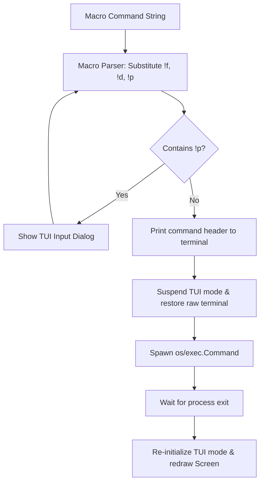

# HERMIT Go Porting Strategy Specification

This document details the strategies and library choices for porting the HERMIT C++ application to Go. It addresses TUI framework design, cross-platform compatibility, configuration representation, and data structure modernization.

---

## 1. Terminal UI (TUI) Architecture Options

To port HERMIT's TUI from the Windows Console API to Go, two primary implementation patterns are recommended:

### Option A: The Charmbracelet TUI Ecosystem (Recommended)
This approach leverages the modern Go TUI stack to build a highly responsive, cross-platform interface that works out-of-the-box on Linux, macOS, and Windows.

* **Framework Components**:
  * **Bubble Tea (`github.com/charmbracelet/bubbletea`)**: Employs the Elm Architecture (`Model`, `Update`, `View`) to manage application state. The file scroll list, the title bar, and the status bar are sub-models that receive events and compute state updates.
  * **Lip Gloss (`github.com/charmbracelet/lipgloss`)**: Handles colors, margins, padding, and border framing. It allows recreating the classic "Norton Commander" blue/white layout, double-line boxes, and highlight cursors.
  * **Bubbles (`github.com/charmbracelet/bubbles`)**: Provides pre-built UI components:
    * `list`: Used for scroll lists like the bookmark, custom command, or verb selector dialogs.
    * `textinput`: Used for single-line inputs (`GotoDialog`, `RunDialog`).
    * `viewport`: Used for scrollable read-only screens (`HelpScreen`, `LicenseScreen`).
* **Overlay Dialogs (Popups)**:
  * Since Bubble Tea uses a declarative rendering model, overlay dialogs can be rendered by layering strings. A helper function can compute the dialog size, draw a border, and place it at the center of the viewport using `lipgloss.Place` or string-stenciling libraries, rendering it on top of the background layout.

### Option B: Direct Grid Wrapper (Tcell Double-Buffer)
If the goal is a direct, line-by-line translation of the C++ layout system:
* **Library**: Use **`github.com/gdamore/tcell/v2`** directly.
* **Architecture**:
  * Write a custom rendering loop matching the original `Screen` class. Maintain a 2D grid of character cells and styles.
  * Popups can copy the state of cells under their bounding box on launch, paint their own contents, and write back the saved cells when dismissed.
  * *Trade-off*: Requires manually implementing all cursor movements, text line editors, and list scroll offsets from scratch.

---

## 2. Modernizing C++ Data Structures

Go's built-in collections and garbage collector make HERMIT's custom C++ storage layers (`tree/` module) obsolete:

* **File Storage**: Replace `FileTree` (binary search tree) and `THeap` (page allocator) with standard Go slices:
  ```go
  type File struct {
      Name      string
      Size      int64
      IsDir     bool
      Mode      os.FileMode
      ModTime   time.Time
      IsTagged  int // 1 = Tagged, 0 = Untagged, -1 = Sort-of-Tagged
  }
  ```
  A directory listing is simply a `[]File` or `[]*File`.
* **Sorting**: Use Go's standard library `slices` package for sorting:
  ```go
  import "slices"

  // Sort files by name
  slices.SortFunc(files, func(a, b File) int {
      if a.IsDir && !b.IsDir { return -1 }
      if !a.IsDir && b.IsDir { return 1 }
      return strings.Compare(a.Name, b.Name)
  })
  ```
* **Map Events**: Replace `HandlerTree` with a standard Go map mapping key codes or input event strings directly to callback functions:
  ```go
  type HandlerFunc func(event Event)
  type HandlerMap map[Key]HandlerFunc
  ```

---

## 3. Configuration & Registry Replacement

The original Windows Registry dependency (`HKEY_CURRENT_USER\Software\Lore\Hermit`) should be replaced with a cross-platform configuration file.

* **Format**: **TOML** (recommended for manual editing) or **JSON/YAML**.
* **Storage Location**:
  * Windows: `%APPDATA%/hermit/config.toml`
  * Linux/macOS: `~/.config/hermit/config.toml`
  * (Obtained dynamically in Go using `os.UserConfigDir()`).

### Suggested Config Schema (`config.toml`)
```toml
[general]
color_scheme = "classic_blue"
debug_mode = false

[bookmarks]
0 = "C:\\projects"
1 = "D:\\downloads"
2 = "C:\\windows"

[commands]
a = { macro = "echo !f", description = "Echo selected file name" }
v = { macro = "vim !q", description = "Edit selected files in Vim" }
z = { macro = "zip archive.zip !q", description = "Archive tagged files" }
```

---

## 4. Cross-Platform Command Execution

Go's standard library `os/exec` provides clean execution models that replace Windows-specific `CreateProcess` calls.

### Spawning Shell Commands
To execute custom command strings (which may contain pipes or shell redirection), run the resolved shell interpreter:
* **Windows**: `cmd.exe /c [command]` (or PowerShell if specified).
* **Linux/macOS**: `sh -c [command]` (or bash).



### Implementing Macro Expansion
A dedicated Go module should handle macro parsing and environment variable queries:
* **Prompt Handling (`!p`)**:
  1. Scan command for `!p`.
  2. For each match, suspend rendering and launch a prompt text input.
  3. Swap the inputs into the command line.
* **File Substitution**:
  1. Lookup `$HERMIT_LISTSEP` (default `" "`) and `$HERMIT_LISTQUOTE` (default `"`).
  2. Map all tagged files into a single string for `!m` and `!q`.
  3. Map `$HERMIT_DIRSEP` (default `\` or `/`) to replace file path slashes for Unix-like shells.
